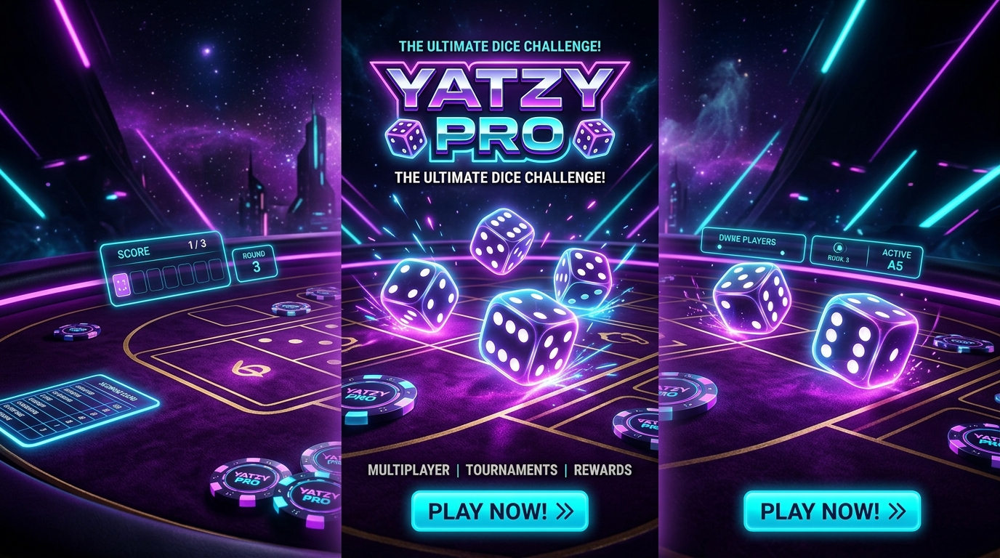
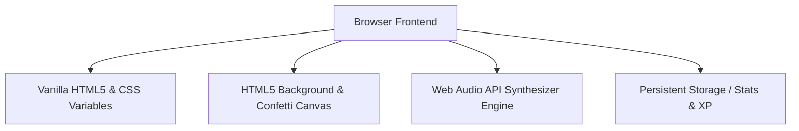

<div align="center">

  <h1>🎲 YATZY PRO</h1>
  <h3>Commercial Edition</h3>

  <p><strong>A AAA-quality, commercial-grade browser implementation of the classic Yahtzee dice game.</strong></p>

  <p>
    <a href="https://github.com/Yashsaxena27/yetzy/stargazers"></a>
    <a href="https://github.com/Yashsaxena27/yetzy/network/members"></a>
    <a href="https://github.com/Yashsaxena27/yetzy/blob/main/LICENSE"></a>
    <a href="#"></a>
    <a href="#"></a>
  </p>

  <p>
    
    
    
    
    
  </p>

  <br />

  

</div>

<br />

---

## 🚀 Live Demo

Experience the tabletop casino gameplay directly in your browser:

<div align="center">
  <a href="https://Yashsaxena27.github.io/yetzy/">
    
  </a>
</div>

<br />

---

## 📸 Screenshots

| 🌌 Tabletop Gameplay | 🏆 Victory & Rewards |
| :---: | :---: |
|  |  |

| 📊 Player Dashboard & Stats | 📱 Mobile Responsive Layout |
| :---: | :---: |
|  |  |

<br />

---

## ✨ Features Grid

| Feature | Description |
| :--- | :--- |
| 🎲 **Hero 3D Dice Physics** | 88px 3D dice with specular gloss, 3D mouse parallax tilt tracking, and landing impact recoil. |
| 🎴 **Velvet Casino Felt Board** | Deep velvet felt tabletop with golden stitching, inset shadows, and ambient spotlight illumination. |
| 🎨 **7 Luxury Themes** | Dark Space, Royal Purple, Cyber Neon, Casino Gold, Ice Blue, Retro Arcade, and Matrix. |
| 🤍 **5 Custom Dice Skins** | Ivory Classic, Cyber Translucent, Gold Metallic, Ruby Gem, and Emerald Crystal. |
| 🎆 **Canvas Fireworks & FX** | Full-screen particle fireworks cannons, camera shake, floating hit popups (`+50 YATZY!`), and screen rumble. |
| 🤖 **3 AI Bot Difficulties** | Play against **Rookie** (Easy), **Pro** (Medium), or **Master** (Hard risk-optimizing AI). |
| 👥 **2-Player Local Pass & Play** | Side-by-side dual-column scorecards for 2-player local matches. |
| 💡 **Best Move Hint Assist** | Intelligent probability engine highlighting the optimal row choice with a golden glow. |
| ↩️ **Undo Move System** | Instant undo protection allowing players to revert accidental category selections. |
| 🎖️ **XP & Leveling Engine** | Earn XP per roll, combo, and win to level up from *Dice Novice* to *Level 5+ Grandmaster*. |
| 🏆 **Achievement Tracker** | 8 unlockable badges with interactive showcase cards and toast notifications. |
| 📊 **Statistics Dashboard** | Comprehensive tracking of Games Played, Win Rate %, Personal Best, Average Score, and Match History. |
| 🎵 **Web Audio Synthesizer** | Real-time synthesized audio for rolls, holds, count-up ticks, and fanfare with master volume slider. |
| 📱 **100% Mobile Native UI** | Sticky bottom roll controls, large touch targets, and responsive layout adjustments. |

<br />

---

## 🛠️ Tech Stack



- **Core**: Vanilla JavaScript (ES6+), HTML5, CSS3 Custom Properties (Variables)
- **Visual Engine**: Hardware-Accelerated 3D CSS Transforms, Canvas2D Particle Systems
- **Audio Engine**: Web Audio API Synthesizer (Zero-dependency sound generator)
- **Persistence**: Browser `localStorage` (XP, Level, Coins, Achievements, Match History, Settings)

<br />

---

## 📁 Folder Structure

```text
yetzy/
├── index.html          # Main application structure & modal dialogs
├── style.css           # 7 Themes, 5 Skins, 3D Felt Table, & Animations
├── game.js             # Core game engine, AI Bots, Canvas FX, & WebAudio
├── assets/             # Repository preview banners & screenshots
│   ├── banner.png
│   ├── gameplay.png
│   ├── home.png
│   ├── mobile.png
│   └── stats.png
├── README.md           # Project documentation
└── LICENSE             # MIT License
```

<br />

---

## ⚡ Quickstart & Local Setup

### 1. Clone the repository
```bash
git clone https://github.com/Yashsaxena27/yetzy.git
cd yetzy
```

### 2. Run locally
Since YATZY PRO is built with pure web technologies, no build steps or dependencies are required.

- **Option A (VS Code)**: Right-click `index.html` and select **Open with Live Server**.
- **Option B (Python HTTP Server)**:
  ```bash
  python -m http.server 8080
  ```
  Open `http://localhost:8080` in your browser.
- **Option C (Node.js npx)**:
  ```bash
  npx serve .
  ```

<br />

---

## 🎮 Controls & Shortcuts

| Input Method | Action |
| :--- | :--- |
| **Mouse / Touch** | Click **Roll Dice** button to roll unheld dice. Click individual die to hold/unlock. Click scorecard row to claim score. |
| **Keyboard `Space` / `Enter`** | Trigger Dice Roll. |
| **Keyboard `1` – `5`** | Toggle hold status for Die 1 through Die 5. |
| **Keyboard `Esc`** | Close open modals or statistics overlay. |

<br />

---

## 🎲 Gameplay & Rules Summary

Yatzy consists of 13 rounds. In each turn, you get up to **3 rolls** to achieve the highest scoring combination:

1. **Upper Section (Ones through Sixes)**: Score the sum of matching numbers. Score 63+ total points to earn a **+35 Upper Bonus**.
2. **Lower Section**:
   - **Three of a Kind / Four of a Kind**: Sum of all 5 dice if 3 or 4 match.
   - **Full House (25 pts)**: 3 of one number and 2 of another.
   - **Small Straight (30 pts)**: 4 consecutive numbers (e.g. 1-2-3-4).
   - **Large Straight (40 pts)**: 5 consecutive numbers (e.g. 2-3-4-5-6).
   - **Yatzy (50 pts)**: All 5 dice matching!
   - **Chance**: Sum of all 5 dice.

<br />

---

## 💎 Project Highlights

- **Commercial-Grade Polish**: Designed to match the visual fidelity of modern published AAA titles on Steam or mobile stores.
- **Zero External Dependencies**: Fast load times (< 100ms) with zero heavy framework overhead.
- **120fps Smooth Animations**: GPU-accelerated CSS transforms and canvas rendering for fluid micro-interactions.
- **Accessibility & Motion Features**: Respects system dark mode, reduced motion settings, and keyboard focus states.

<br />

---

## 🏎️ Performance Optimizations

- **Efficient DOM Reconciliation**: Updates only modified score cells and pip states to eliminate layout thrashing.
- **Decoupled Animation Loop**: Canvas particles and background aurora mesh run on a single `requestAnimationFrame` thread.
- **Hardware-Accelerated Layering**: 3D dice transforms utilize `transform: translate3d()` and `will-change` hints for 120fps feel.

<br />

---

## 🗺️ Future Roadmap

- [ ] 🌐 **Online Real-Time Multiplayer** (WebSockets / PeerJS)
- [ ] ☁️ **Cloud Save Sync** (Supabase / Firebase integration)
- [ ] 🏆 **Global Online Leaderboards**
- [ ] 🗓️ **Daily & Weekly Challenges**
- [ ] 🎟️ **Season Pass Cosmetic Unlocks**
- [ ] 📱 **Progressive Web App (PWA) Offline Support**
- [ ] 🔊 **Custom Sound Packs** (Retro Arcade soundpack, Casino Jazz ambience)

<br />

---

## 🤝 Contributing

Contributions, issues, and feature requests are welcome!

1. Fork the Project (`https://github.com/Yashsaxena27/yetzy/fork`)
2. Create your Feature Branch (`git checkout -b feature/AmazingFeature`)
3. Commit your Changes (`git commit -m 'Add some AmazingFeature'`)
4. Push to the Branch (`git push origin feature/AmazingFeature`)
5. Open a Pull Request

<br />

---

## 📄 License

Distributed under the **MIT License**. See [`LICENSE`](./LICENSE) for more information.

<br />

---

## 👤 Author

**Yash Saxena**
- GitHub: [@Yashsaxena27](https://github.com/Yashsaxena27)

<br />

---

## 💖 Acknowledgements

Inspired by:
- **Classic Yahtzee** board game mechanics
- **Monopoly GO & Supercell** UI polish and tactile game feel
- **Apple VisionOS & Linear** clean glassmorphism aesthetics

<br />

---

<div align="center">

  <h3>Show your support!</h3>

  <p>If you enjoy YATZY PRO, please consider giving it a ⭐ star on GitHub!</p>

  <a href="https://github.com/Yashsaxena27/yetzy">
    
  </a>

</div>
